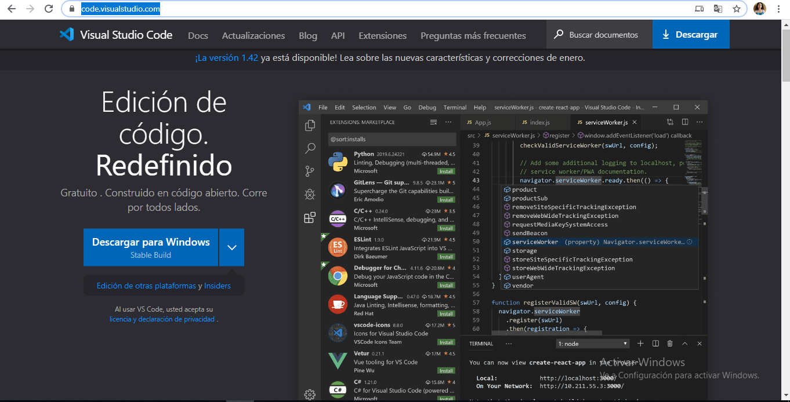

# Ejercicio de Markdown

## Instalación de dotnet core 2.2.
Lo primero que tenemos que hacer 
es bajar el archivo de instalacion del siguiente 
[lugar](https://dotnet.microsoft.com/download/dotnet-core/3.0)
Es importante bajar el SDK Core, porque **vamos a programar**.

La pagina se ve asi: 

## Instalación y configuración de Visual Studio Code para C#.
Tenemos que bajar el archivo de instalacion del siguiente 
[lugar](https://code.visualstudio.com/)
Es importante descargar la version de acuerdo a el **sistema
operativo**

La pagina se ve asi:

Aceptar licencia de terminos:

Despues seleccionar la carpeta de destino:

En seguido, seleccionamos la carpeta del menu de inicio:

Despues, seleccionar las tareas adicionales que desees y dar
siguiente:

Aparecera una ventana donde dice que ya esta listo para
la instalacion: 

Y listo, se estara descargando en unos minutos:

Por ultimo, da finalizar a la instalacion:

## Instalación de git. conectado a tu cuenta de GitHub y VSC.
